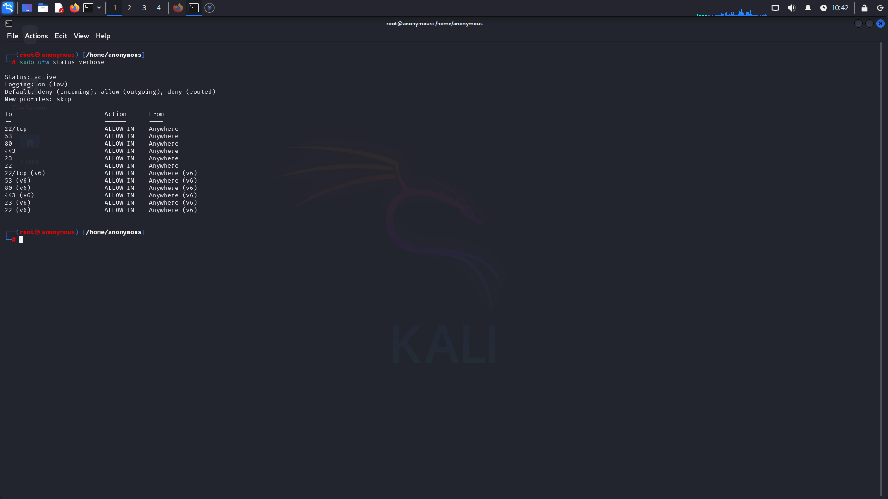
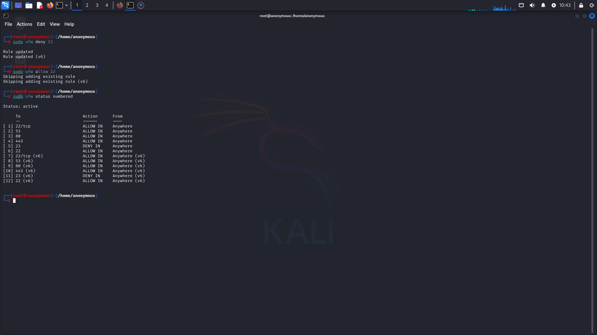
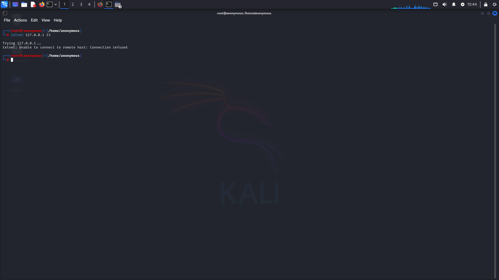
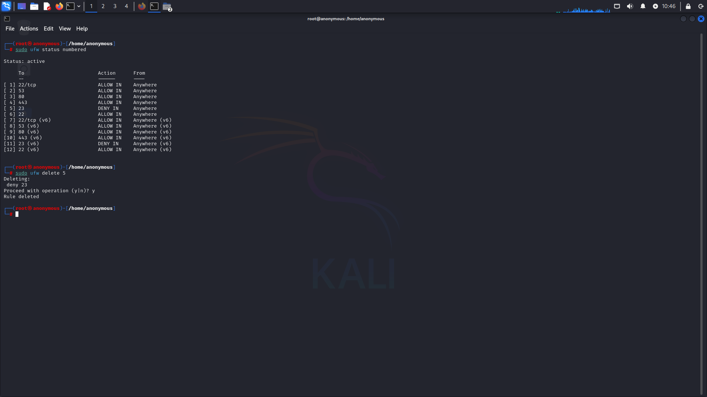

#  Task 4 – UFW Firewall Configuration | Cybersecurity Internship

This task demonstrates **configuring, testing, and restoring firewall rules** using **UFW (Uncomplicated Firewall)** on Kali Linux. The main focus is on controlling network traffic by blocking and allowing specific ports, verifying access restrictions, and restoring configurations.

---

##  Tools Used
- **UFW** – Command-line firewall utility for managing iptables.
- **Telnet** – Used for connectivity testing to specific ports.
- **Kali Linux Terminal** – Execution environment.

---

##  Objectives
- Configure firewall rules to block/allow specific ports.
- Verify firewall rules using port connectivity tests.
- Demonstrate the process of restoring original firewall configurations.

---

##  Screenshots & Explanations

### 1) Initial Firewall Rules
Before making any changes, the current firewall rules were checked.

- Shows allowed/denied ports.
- Helps establish the baseline before modifications.

---

### 2) Adding and Blocking Rules
Blocked **port 23** (Telnet) to prevent unauthorized access while ensuring other necessary ports remained open.

- `sudo ufw deny 23` command used to block the port.
- Security best practice to disable unused services.

---

### 3) Testing the Blocked Port
Attempted to connect to **127.0.0.1:23** using Telnet after blocking the port.

- Connection was **refused**, confirming the firewall successfully blocked the port.

---

### 4) Restoring Firewall Rules
Restored firewall rules to the original configuration for normal operation.

- Deleted the deny rule for port 23.
- Verified restored settings with `sudo ufw status numbered`.

---

##  Steps Performed
1. Checked current firewall status:
   ```bash
   sudo ufw status numbered

2. Blocked Telnet (port 23):

   ```bash
   sudo ufw deny 23
   
3. Verified block with Telnet:

   ```bash
   telnet 127.0.0.1 23
   
4. Removed the deny rule:

   ```bash
   sudo ufw delete <rule_number>
   
5. Restored firewall to original state.

---

##  Key Takeaways

* Blocking unused ports reduces attack surface.
* UFW provides a simple yet powerful way to manage firewall rules.
* Always verify changes with connectivity tests.
* Documenting configurations ensures clarity for audits.

---

##  Author

**🔹 Author:** Mohammad Farhan Hussain
**🔹 Internship:** Elevate Labs Cybersecurity Internship
**🔹 Tools:** UFW, Telnet, Kali Linux

